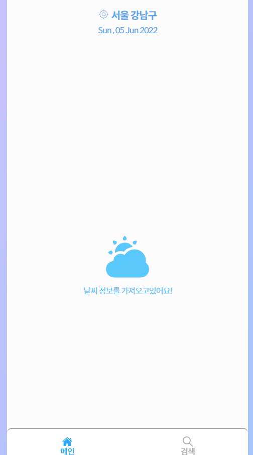

## Weather App

## 📜 프로젝트 개요
유저의 위치를 기반으로 날씨정보 제공

## 🔗 프로젝트 배포

### 🔗 [베포사이트](https://juiweatherapp.netlify.app/)

## ⚙ 기술 스택
  
  
  
  

```
그 외 추가 라이브러리
  - swiper
  - dayjs

```

## 🎄 프로젝트 트리
```
src
 ┣ assets       // json, svg 파일
 ┣ components   // 공통으로 사용하는 컴포넌트
 ┣ hooks        // Custom Hooks
 ┣ routes       // 페이지
 ┣ util         // JSON 처리 관련
 ┣ styles       // 전역 style
 ┣ types        // 필요한 type 정의
```

## 📍 Getting Started / 어떻게 시작하나요?

1. Repository 클론
```sh
$ git clone https://github.com/Team8-Rocket/kb-healthcare.git
```

2. Dependencies 설치
```sh
$ yarn install
```

3. Run 실행
```sh
$ yarn start
```

## 🖼 실행 이미지



## 🔧구현 방법 
### 날씨 정보
> Weather Component
- OpenWeatherMap를 사용하여 지역의 좌표로 날씨 정보를 받았습니다.
- onecall 요청으로 현재 날씨, 시간별, 일주일간의 날씨정보를 가져왔습니다.
- 초기 위치 정보는 서울 강남으로 설정하며 상단의 위치 또는 검색 페이지에서 원하는 위치를 검색 할 수 있도록 구현했습니다.
- 시간별 날씨 정보는 swiper 패키지를 사용하여 좌우로 스크롤 할 수 있습니다.

### 위치 검색
> Search Component
- 카카오 로컬 검색 api를 사용하여 주소를 입력하면 좌표값을 받았습니다.
- api 에서 받은 좌표를 redux로 관리하며 좌표가 바뀔때마다 날씨 정보를 다시 받아 오로독 구현하였습니다.
- localstoge를 이용하여 최근 검색한 주소를 저장하며 해당 주소를 클릭하면 자세한 날씨 정보를 리랜더링 해줍니다.


## 🔥 어려웠던 점
- 로컬 검색 api에서 받아온 좌표를 dispatch하는것이 어려웠습니다.

## 💎 현재 이슈

